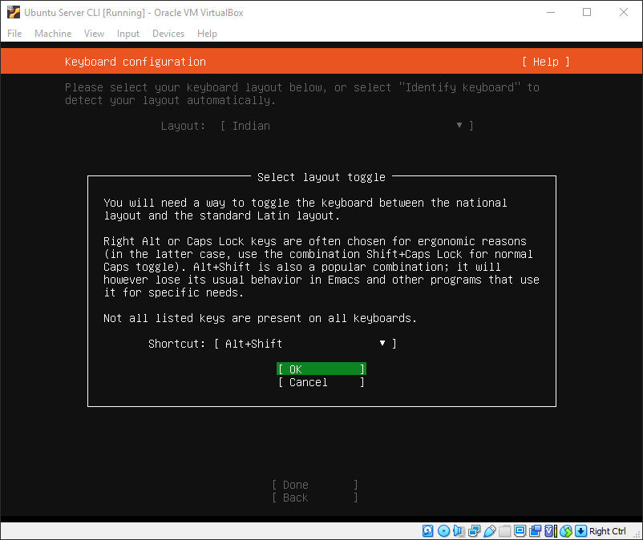
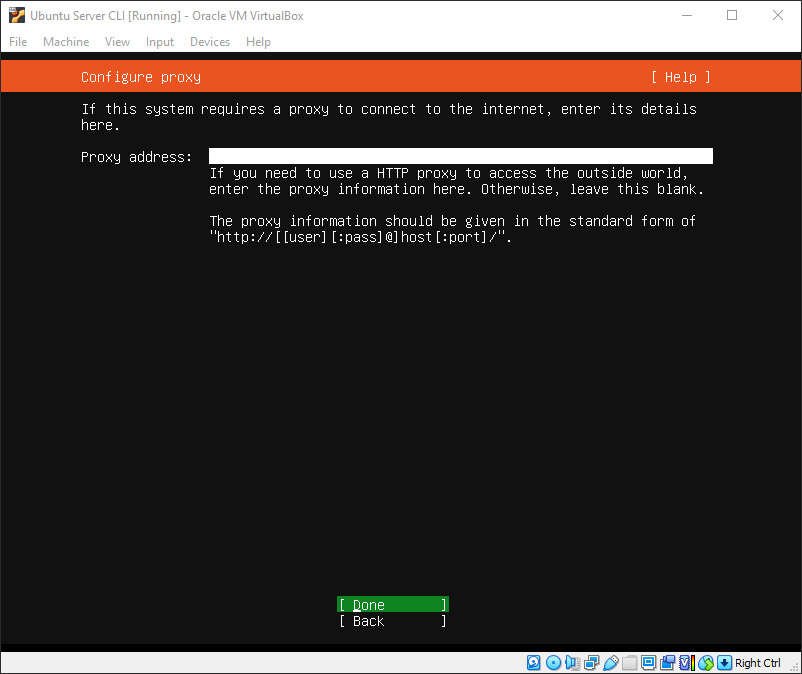
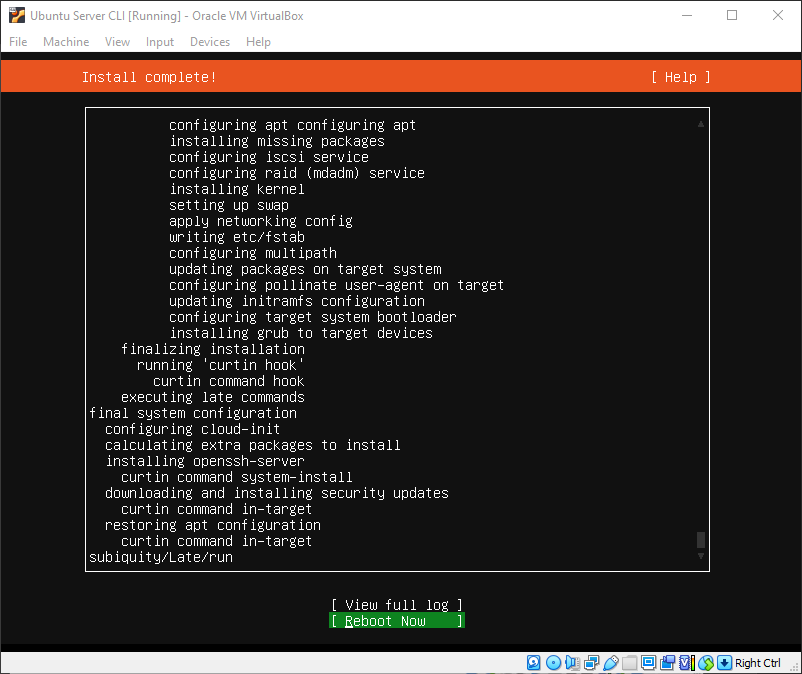

# LAMP Setup

Install & Setup Ubuntu Server, Apache2, PHP, Maria DB, PhpMyAdmin (PMA) and also secure PMA and change php my admin port and enable htaccess.

Table of contents
=================
<!--ts-->
   * [Ubuntu Server Installation](#ubuntu-server-installation)
      * [Configure the language and update the installer](#1-configure-the-language-and-update-the-installer)
      * [Configure your keyboard](#2-configure-your-keyboard)
      * [Choose the type of installation](#3-choose-the-type-of-installation)
      * [Configure the network](#4-configure-the-network)
      * [Configure Mirror](#5-configure-mirror)
      * [Configure storage](#6-configure-storage)
      * [Create a user](#7-create-a-user)
      * [SSH Setup and software installation](#8-ssh-setup-and-software-installation)
      * [Installing..](#9-installing)
      * [Installation Complete](#10-installation-complete)
   * [Ubuntu Server Post-Installation](#ubuntu-server-post-installation)
      * [Login](#1-first-time-login)
      * [Update & Upgrade](#2-update--upgrade)
      * [Show system IP](#3-show-system-ip)
   * [Login to SSH](#login-to-ssh)
   * [Install Apache2](#install-apache2)
   * [Install & Setup MariaDB](#install--setup-mariadb)
      * [Install MariaDB](#1-install-mariadb)
      * [MariaDB Secure Installation](#2-mariadb-secure-installation)
      * [Create phpMyAdmin user for MariaDB](#3-create-phpmyadmin-user-for-mariadb)
   * [Install & Setup MariaDB](#install--setup-mariadb)
   * [Install & Setup PHP phpMyAdmin](#install--setup-php-phpmyadmin)
   * [Securing Your phpMyAdmin Instance](#securing-your-phpmyadmin-instance)
   * [Change phpMyAdmin Instance Port](#change-phpmyadmin-instance-port)
   * [Set MariaDB root Password](#set-mariadb-root-password)
<!--te-->
Ubuntu Server Installation
===========================
<details>
<summary>Show/Hide</summary>

## 1. Configure the language and update the installer

Boot your machine or insert your USB drive into your machine and boot it up. In the first window (Figure 1), select (using your keyboard up/down arrows) Try or install Ubuntu Server and hit Enter on your keyboard.


In the next window (Figure 2), we select the language for the installation.

Using your arrow keys, select your language of choice and hit Enter on your keyboard.


## 2. Configure your keyboard

On the next screen, you are asked to configure your keyboard. Select both the layout and the variant.


When you're done, select Done (using your arrow keys) and hit Enter on your keyboard.

Select toggle layout hit Enter on your keyboard.




## 3. Choose the type of installation

Next, we'll select the base for the installation. Here (Figure 5), you'll want to select Ubuntu Server (to get the most tools installed by default) and continue.


## 4. Configure the network

Here (Figure 6) you have two choices. You can either go with the default DHCP or configure a static IP address. Here I will setup DHCP.


Configure proxy we not going to setup proxy leave it blank and hit Enter on your keyboard.




## 5. Configure Mirror

Leave it default and hit Enter on your keyboard.


## 6. Configure storage

We're going to use our entire disk drive for the installation (which is the default), so leave everything as is (Figure 9), tab down to Done, and hit Enter on your keyboard.


Review the layout (everything should be good) and hit Enter again to accept the configuration (Figure 10).


You'll then be prompted to verify the destructive action (Figure 11), so select Continue with your arrow keys and hit Enter on your keyboard.


## 7. Create a user

You will now be asked to create a user for the installation (Figure 12). Type out the required details, tab down to Done, and hit Enter on your keyboard.


## 8. SSH Setup and software installation

You will, of course, want to enable secure shell access to the server (so you can remotely access it). In the resulting window (Figure 12), enable the installation of the OpenSSH server by hitting the spacebar on your keyboard and then tabbing down to Done.


In the next screen (Figure 14), scroll through the list of available software to install (selecting the ones you want with the spacebar) I am not going to install anything from this list.  


After you've made your selections, tab down to Done and hit Enter on your keyboard.


## 9. Installing...

At this point, the installation will begin and should take anywhere from 5-10 minutes to complete. 


## 10 Installation Complete

Once it finishes, make sure to select Reboot now, remove your USB device.


</details>


Ubuntu Server Post-Installation
===============================
<details>
<summary>Show/Hide</summary>

## 1. First time login

After Installation Complete boot the system and login with username and password that you set during installation.


## 2. Update & Upgrade

After login update and upgrade the system

Command
```
sudo apt update && upgrade -y
```


## 3. Show system IP

Now we need to know our system ip for ssh remote login, for this we need to install a package called 'net-tools' for installing this run the following command

Command
```
sudo apt install net-tools -y
```


After installing the package we can run 'ifconfig' command to know our system ip


</details>


Login to SSH
=============
<details>
<summary>Show/Hide</summary>
For login to our newly setup Ubuntu Server use ssh from another machine with command <ssh uesrname@ip>


</details>


Install Apache2
===============
<details>
<summary>Show/Hide</summary>

To install Apache on Ubuntu server, run the commands below.

```
sudo apt install apache2
```


After installing Apache, the commands below can be used to stop, start and enable Apache services to always start up with the server boots.

command

```
sudo systemctl stop apache2.service && sudo systemctl start apache2.service && sudo systemctl enable apache2.service
```


To find out if Apache is installed and running, simply open your web browser and type in the server’s IP or hostname.


If you see similar page as above (Figure 20), Apache is installed and functioning.
</details>


Install & Setup MariaDB
========================
<details>
<summary>Show/Hide</summary>

## 1. Install MariaDB

phpMyAdmin is a tool to manage database servers. For our database server, we’re going to install MariaDB. phpMyAdmin should also work with MySQL database server, but we’re going install it here.

To install MariaDB run the commands below.

```
sudo apt install mariadb-server mariadb-client
```


After installing MariaDB, the commands below can be used to stop, start and enable MariaDB service to always start up when the server boots.

command
```
sudo systemctl stop mariadb.service && sudo systemctl start mariadb.service && sudo systemctl enable mariadb.service
```


## 2. MariaDB Secure Installation

Run the commands below to secure MariaDB server by creating a root password, disallowing remote root access removing anonymous and more.

command
```
sudo mysql_secure_installation
```

```
If you've just installed MariaDB, and haven't set the root password yet, you should just press enter here.

Enter current password for root (enter for none): PRESS ENTER

Switch to unix_socket authentication [Y/n] n

Change the root password? [Y/n] y
New Password:
Re-enter new password:

Remove anonymous users? [Y/n] y

Disallow root login remotely? [Y/n] y

Remove test database and access to it? [Y/n] y

Reload privilege tables now? [Y/n] y

All done!
```

## 3. Create phpMyAdmin user for MariaDB

Since root users shouldn’t be used to connect remotely to the database. A recommended method is to create a dedicated user to connected remotely to your database servers.

Since you don’t want to connect to MariaDB database server from phpMyAdmin as root user, you should probably create a separate account instead of connecting with root.

Run the commands below to logon to MariaDB server.

command

```
sudo mysql -u root -p
```

Then run the SQL commands below to create a new user for phpMyAdmin to use to connect to the database.

SQL Command

```
CREATE USER 'an_username'@'localhost' IDENTIFIED BY 'user_password';
GRANT ALL PRIVILEGES ON *.* TO 'an_username'@'localhost' WITH GRANT OPTION;
exit;
```


**NB: This Username and Password Will require at the time of PhpMyAdmin login**

</details>


Install & Setup PHP phpMyAdmin
===============================
<details>
<summary>Show/Hide</summary>

Run the following command to install php and its dependencies

command
```
sudo apt install php php-common php-mysql php-gmp php-curl php-intl php-mbstring php-xmlrpc php-gd php-xml php-cli php-zip -y
```


Now that Apache and PHP are installed the final step is to install phpMyAdmin and configure. To do that, run the commands below

command
```
sudo apt install phpmyadmin -y
```


When prompted to choose the webserver, select apache2 and continue.

```
+------------------------+ Configuring phpmyadmin +------------------------+
| Please choose the web server that should be automatically configured to   |  
| Web server to reconfigure automatically:                                  |
|                                                                           |
|    [*] apache2                                                            |
|    [ ] lighttpd                                                           | 
|                                 <ok>                                      |
 +-------------------------------------------------------------------------+
```


When prompted again to allow debconfig-common to install a database and configure select Yes and press ENTER.

Then type and confirm the password you set at the time of crating phpmyadmin user in MariaDB.


```
+------------------------+ Configuring phpmyadmin +-------------------------+
 |                                                                           |
 | The phpmyadmin package must have a database installed and configured      |
 | before it can be used.  This can be optionally handled with               |
 | dbconfig-common.                                                          |
 |                                                                           |
 | If you are an advanced database administrator and know that you want to   |
 | perform this configuration manually, or if your database has already      |
 | been installed and configured, you should refuse this option.  Details    |
 | on what needs to be done should most likely be provided in                |
 | /usr/share/doc/phpmyadmin.                                                |
 |                                                                           |
 | Otherwise, you should probably choose this option.                        |
 |                                                                           |
 | Configure database for phpmyadmin with dbconfig-common?                   |
 |                                                                           |
 |                  <Yes>                  <No>                              |
 |                                                                           |
 +---------------------------------------------------------------------------+
```


Then restart apache

command

```
sudo systemctl restart apache2
```
</details>


Securing Your phpMyAdmin Instance
=================================
<details>
<summary>Show/Hide</summary>

Because of its ubiquity, phpMyAdmin is a popular target for attackers, and you should take extra care to prevent unauthorized access. One way of doing this is to place a gateway in front of the entire application by using Apache’s built-in .htaccess authentication and authorization functionalities.

To do this, you must first enable the use of .htaccess file overrides by editing your phpMyAdmin installation’s Apache configuration file.

Use your preferred text editor to edit the `phpmyadmin.conf` file that has been placed in your Apache configuration directory. Here, we’ll use nano:

command

```
sudo nano /etc/apache2/conf-available/phpmyadmin.conf
```

Add an `AllowOverride All` directive within the `<Directory /usr/share/phpmyadmin>` section of the configuration file, like this:

```
<Directory /usr/share/phpmyadmin>
    Options SymLinksIfOwnerMatch
    DirectoryIndex index.php
    AllowOverride All
    . . .
```

When you have added this line, save and close the file. If you used nano to edit the file, do so by pressing CTRL + X, Y, and then ENTER.

To implement the changes you made, restart Apache

```
sudo systemctl restart apache2
```

Now that you have enabled the use of .htaccess files for your application, you need to create one to actually implement some security.

In order for this to be successful, the file must be created within the application directory. You can create the necessary file and open it in your text editor with root privileges by typing:

command

```
sudo nano /usr/share/phpmyadmin/.htaccess
```
Within this file, enter the following information:

```
AuthType Basic
AuthName "Restricted Files"
AuthUserFile /etc/phpmyadmin/.htpasswd
Require valid-user
```

When you are finished, save and close the file.

The location that you selected for your password file was /etc/phpmyadmin/.htpasswd. You can now create this file and pass it an initial user with the htpasswd utility:

command

```
sudo htpasswd -c /etc/phpmyadmin/.htpasswd username
```

Then restart Apache to put .htaccess authentication into effect:

command

```
sudo systemctl restart apache2
```

</details>


Change phpMyAdmin Instance Port
=================================
<details>
<summary>Show/Hide</summary>

to change the port use nano to open the `phpmyadmin.conf` file then paste the following text change 99 to your desired port.

```
Listen 99

<VirtualHost *:99>

        ServerName localhost

        <Directory /usr/share/phpmyadmin>
                AllowOverride None
                Require all granted
        </Directory>

        DocumentRoot /usr/share/phpmyadmin

        Include /etc/phpmyadmin/apache.conf

        ErrorLog ${APACHE_LOG_DIR}/phpmyadmin.error.log
        CustomLog ${APACHE_LOG_DIR}/phpmyadmin.access.log combined

</VirtualHost>
```
Then save and close the file and run the following command

Command

```
sudo a2disconf phpmyadmin && sudo a2ensite phpmyadmin && sudo systemctl restart apache2.service
```

</details>


Set MariaDB root Password
==========================
<details>
<summary>Show/Hide</summary>

Now we have to set a root password for MariaDB

Run the commands below to logon to MariaDB server.

command

```
sudo mysql -u root
```
Now enter the following commands to set root password in mariadb

SQL Commands

```
ALTER USER 'root'@'localhost' IDENTIFIED BY 'root_password';
flush privileges;
exit;
```


